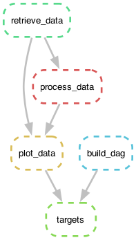

# snakemake-tutorial
A brief tutorial on `snakemake`.

This repository contains two workflows
* `workflow_empty` -- an empty workflow with some suggested items to practice.
* `workflow_solution` -- a complete workflow with my solutions.

`Snakemake` is an incredibly rich workflow management tool and this tutorial barely 
scrapes the surface. The purpose of this tutorial is simply to get you started using
`snakemake` with as little overhead as possible.

## Getting started 

The only pre-work needed for this repository is to

1. Clone the repository using your preferred method, 

```bash
git clone git@github.com:samgdotson/snakemake-tutorial.git
```

2. Create the `conda` or `mamba` environment with

```bash
cd snakemake-tutorial
mamba env create
mamba activate snakemake-tutorial
```


## Creating a workflow


### Step 0: Determine what steps your workflow needs.

As with all programming projects it's good to start with an outline. Doing so
will help ensure _atomized_ steps in the workflow such that no single step 
becomes too large.

| If you can be one thing, be ~~efficient~~ _atomic_.

This example workflow will have three steps.

1. Retrieve some data.
2. Process some data.
3. Create a plot with the data.
4. Generate the DAG. 


### Step 1: Create a rule to retrieve some data

A minimal `snakemake` rule has three parts:
* output
* something-to-execute

It looks something like this:

```py
rule retrieve_data:
    output: "uiuc_demand_data.csv"
    shell:
        """
        wget https://raw.githubusercontent.com/samgdotson/2021-dotson-ms/refs/heads/master/data/uiuc_demand_data.csv
        """
```

This rule uses `wget` to retrieve data used in my Master's thesis and saves it to the file `uiuc_demand_data.csv`. Since no 
other locations were specified, it will be saved to the same directory as the `Snakefile`.

**What if I wanted to save it to a `data` folder?**

You would have to change the `output` to `data/uiuc_demand_data.csv` and update the shell script to save it to a 
specific path. The new rule looks like:

```py
rule retrieve_data:
    output: "data/uiuc_demand_data.csv"
    shell:
        """
        wget https://raw.githubusercontent.com/samgdotson/2021-dotson-ms/refs/heads/master/data/uiuc_demand_data.csv -P data
        """
```

But this is still kind of clunky. Changing the filepath can get cumbersome quickly if there are several rules that interact
with the `data` folder -- which you may rename later. Fortunately, `Snakefiles` are just Python scripts. So you can do anything
you would normally do in a Python script, in a `Snakefile`. 

**Variables and Wildcards**
We can use `wildcards` to serve as placeholders for our path names. We can also create variables in our `Snakefile`. 

Let's do that now.

```py
data_url = ("https://raw.githubusercontent.com/"
            "samgdotson/2021-dotson-ms/refs/heads/"
            "master/data/uiuc_demand_data.csv")

data_path = "data"

rule retrieve_data:
    output: f"{data_path}/uiuc_demand_data.csv"
    shell:
        """
        wget {data_url} -P {data_path}
        """
```

**Run the step**

To run this step, we simply execute the following

```bash
snakemake retrieve_data --cores=1  # or -j1 will also work
```

### Step 2: Create a rule to process the data

Now that we retrieved some data, we should do something with it.

```py
rule process_data:
    input: 
        data = f"{data_path}/uiuc_demand_data.csv"
    output: 
        processed_data = f"{data_path}/processed_data.csv"
    script: "scripts/process_data.py" 
```

The `script` command should point to the directory _relative to the Snakefile_.


### Step 3: Now create a rule to plot the data!

This should be easy enough...

```py
rule plot_data:
    input: 
        data = f"{data_path}/uiuc_demand_data.csv",
        processed_data = f"{data_path}/processed_data.csv"
    output: 
        plot = f"{figure_path}/my_plot.png"
    script: "scripts/plot_data.py"
```

But, what if we wanted to have some universal parameters for one or all of our scripts? 
We can achieve this with a `config.yml` file!

**Adding a `config` file**

At the top of your `Snakefile` write:

```py
configfile: path/to/config.yml
```

Now, you can use the parameters you create in the config file anywhere in your scripts using

```py
snakemake.config['my_parameter_key']
```

For the plotting script I added an option to change the background color of the plot with

```yml
plot_options:
    facecolor: 'lightgray'
```

and called it using

```py
plot_options = snakemake.config['plot_options']
fig, ax = plt.subplots(**plot_options)
```

### Step 4: Create a rule to run the entire workflow!

This step is important because until now, we've had to run every rule individually.
By adding a rule called `all` or `targets` at the _top_ of the `Snakefile`, we can
execute the entire workflow with one command.


### Step 5: (optional) Building the DAG

The directed acyclic graph (DAG) shows the flow of data through your pipeline! This is an 
optional step, but I like having it. 

```py
rule build_dag:
    input: "Snakefile"
    output:
        "dag.png"
    shell:
        "snakemake --dag | dot -Tpng > {output}"
```

and it creates a lovely graph shown below!

